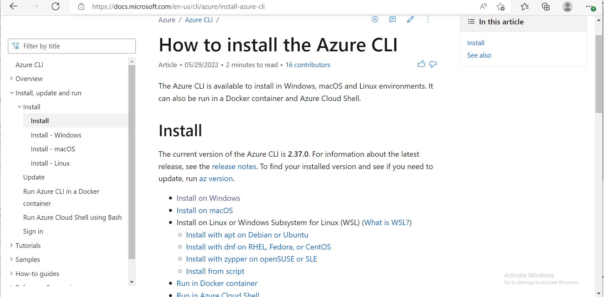
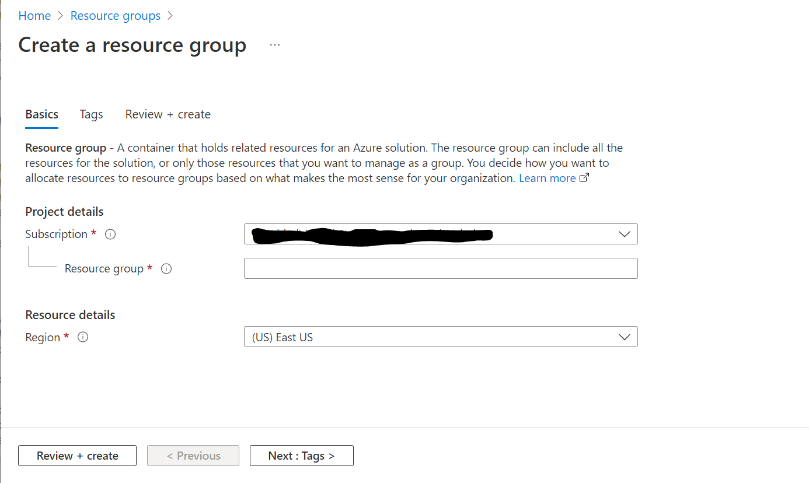
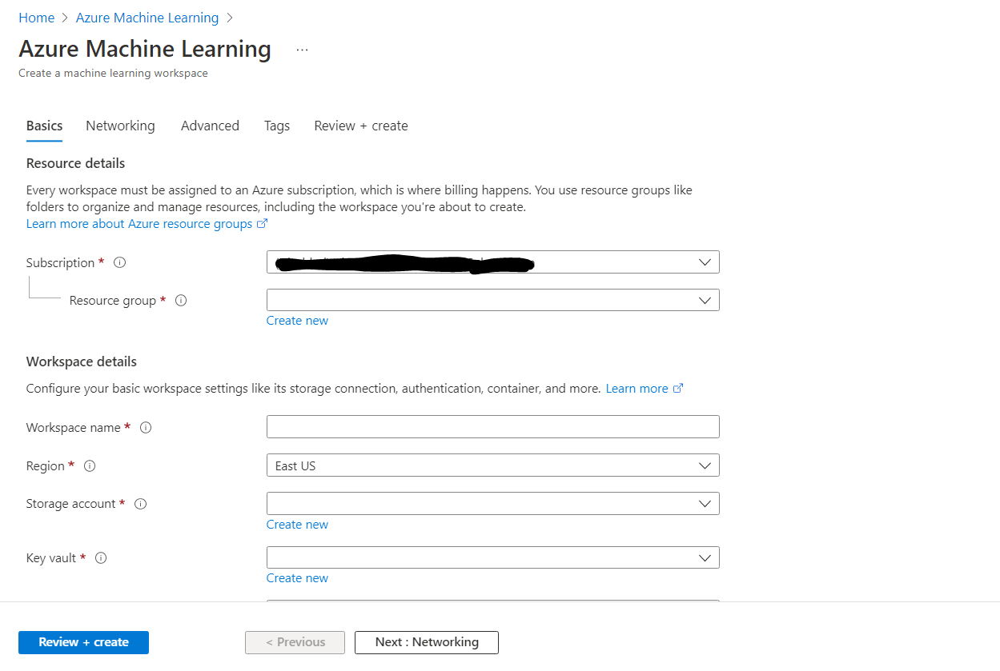
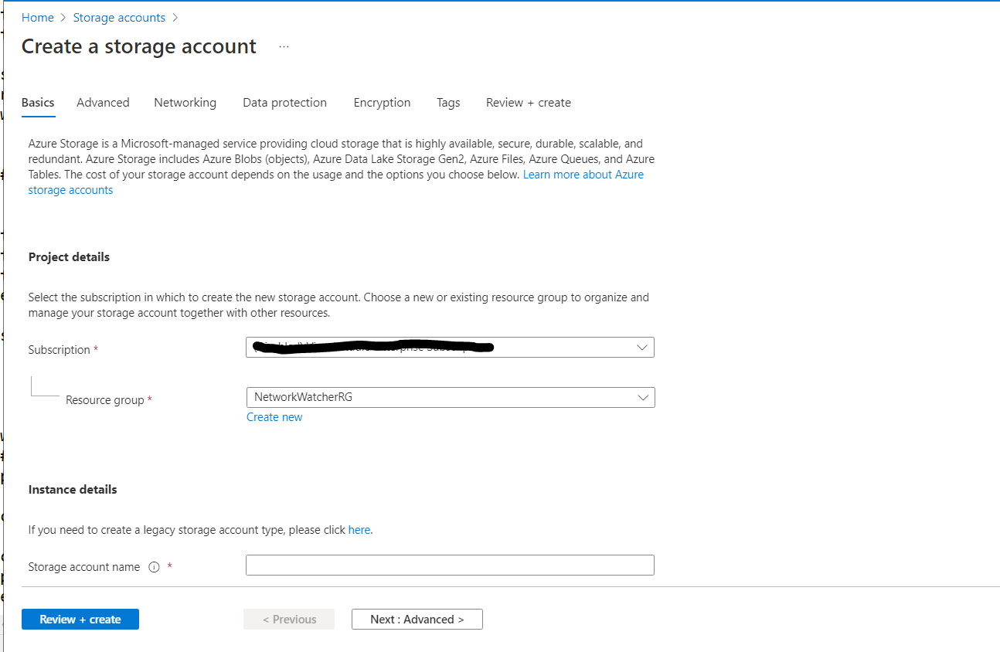
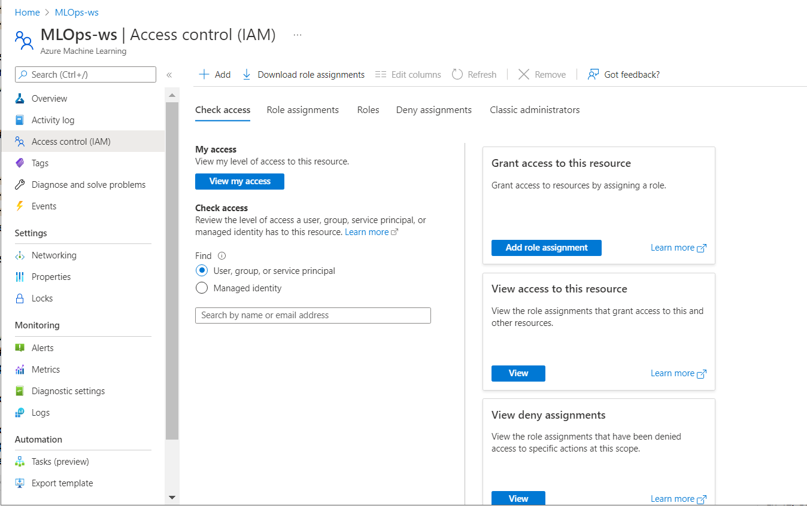
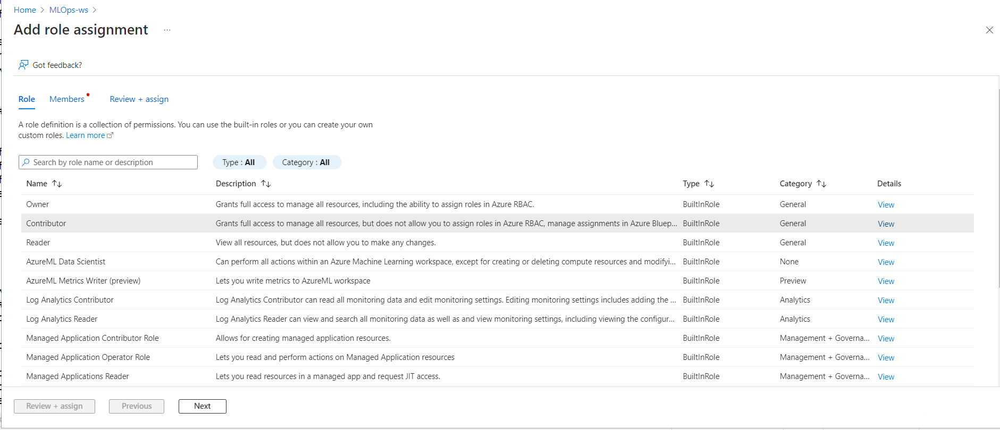
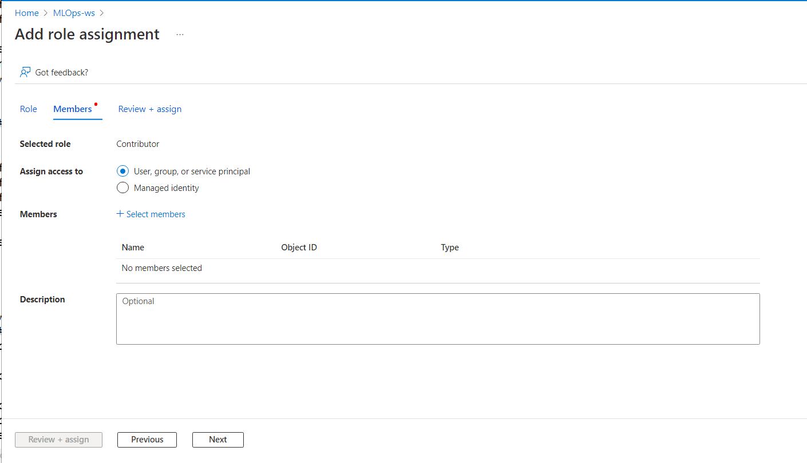

# Machine Learning in Microsoft Azure

Instead of using multiple open source frameworks for a Machine Learning pipeline,[Microsoft Azure](https://azure.microsoft.com/) provides
a common platform to perform the same.


## Steps to recreate:<br>
**1. Install Azure CLI, Download from website and Login**

<p align = "center">

  <em>Download the azure cli from the official page</em>
 </p>
<br>

**2. Use UI for Creating resource group or CLI**

<p align = "center">

  <em>Create a resource group</em>
 </p>

<br>

```
az group create --name <name> --location <loc>
```

<br>

**3. Create a machine learning workspace**

<br>
Use UI to create ML workspace under resource group created before or the cli 
<p align = "center">

  <em>Create a Machine learning workspace under the resource group</em>
 </p>

<br>

```
az ml workspace create -w <name> -g <group-name>
```

**4. Setup blob storage and Upload data**
<br>
<p align = "center">

  <em>Create a storage account under the resource group</em>
 </p>
<br>

**5. Create Service Principal for Authentication**

```
az ad sp create-for-rbac --name <service-name>
```

<br>
<p align = "center">

  <em>Goto IAM of azure machine learning workspace and add role assignment</em>
 </p>
<br>
<p align = "center">

  <em>Select role as contributer</em>
 </p>
<br>
<p align = "center">

  <em>Add the service principal created under members</em>
 </p>
<br>

**6. Upload Data to the storage account manually or use** [Azure Dataset](https://docs.microsoft.com/en-us/python/api/azureml-core/azureml.core.dataset.dataset?view=azure-ml-py)

<br>

**7. Setup Environment:**

<br>
Use CondaDependencies to add the required conda and pip packages.

```
def create_aml_environment(aml_interface):
    aml_env = Environment(name=AML_ENV_NAME)
    conda_dep = CondaDependencies()
    conda_dep.add_pip_package("numpy==1.18.2")
    conda_dep.add_pip_package("pandas==1.0.3")
    conda_dep.add_pip_package("scikit-learn==0.22.2.post1")
    conda_dep.add_pip_package("joblib==0.14.1")
    whl_filepath = retrieve_whl_filepath()
    whl_url = Environment.add_private_pip_wheel(
        workspace=aml_interface.workspace,
        file_path=whl_filepath,
        exist_ok=True
    )
    conda_dep.add_pip_package(whl_url)
    aml_env.python.conda_dependencies = conda_dep
    aml_env.docker.enabled = True
    return aml_env
```
<br>or you can add the packages directly in main driver code

``` 
env.python.conda_dependencies = CondaDependencies.create(
	conda_packages = ['packages'],
	pip_packages = ['packages'],
	pin_sdk_version = False)
```

<br>

**8. Sample driver code for main file:**

```
from azureml.core import Workspace
from azureml.core.run import Run
from azureml.core import Experiment, Environment
from azureml.core.compute import ComputeTarget, AmlCompute
from azureml.core.authentication import ServicePrincipalAuthentication
from azureml.core.conda_dependencies import CondaDependencies
from azureml.core import Experiment, ScriptRunConfig
from azureml.widgets import RunDetails
env = Environment('your-env-name')

subscription_id = 'your-sub-id'
resource_group = 'your-rg-name'
workspace_name = 'your-ws-name'

# It is recommended to add the authentication details as env variables
sp = ServicePrincipalAuthentication(
        tenant_id= "your-tenant-id",
        service_principal_id= "your-sp-id",
        service_principal_password= "your-sp-pass",
    )
ws = Workspace.get( workspace_name,auth = sp,subscription_id = subscription_id, resource_group = resource_group)

print("ready, ",ws.name)
cluster_name = 'your-cluster-name'
cluster = ComputeTarget(workspace = ws,name = cluster_name)

print("found cluster,",cluster)

env.python.conda_dependencies = CondaDependencies.create(
	conda_packages = [packages],
	pip_packages = [packages],
	pin_sdk_version = False)

script_config = ScriptRunConfig(source_directory='your-src-dir',
                                script='Main-file-to-run',
                                compute_target=cluster,
				) 


env.python.user_managed_dependencies = False
script_config.run_config.environment = env

exp_name = 'your-exp-name'
exper = Experiment(workspace = ws,name = exp_name)
run = exper.submit(config = script_config)
run.wait_for_completion(show_output = True)

```

# Integrating Devops into Azure ML

In order to integrate Devops into Machine learning, In addition to above steps create a yml file for devops pipeline with the required
steps and unit tests. We can also split the pipeline into multiple steps such as:
- **Data Pipeline**
- **Environment Pipeline**
- **Model Training Pipeline**
- **Model Deployment Pipeline**
- **Continuous Integration (CI) Pipeline**

## Sample Training pipeline YML

```

name: 'training_pipeline'
jobs:
  - job: 'training_pipeline_job'
    pool:
      vmImage: 'ubuntu-latest'
    
    steps:
      - task: UsePythonVersion@0
        inputs:
          versionSpec: '3.7'
          architecture: 'x64'
    
      - script: |
          python -m pip install --upgrade pip
          pip install -r requirements.txt
        displayName: 'Install requirements'
    
      - script: |
          python src/model.py
        displayName: 'Run AML Experiment and Register Model'
        env:
          TENANT_ID: $(TenantID)
          SPN_ID: $(SpnID)
          SPN_PASSWORD: $(SpnPassword)
          AML_WORKSPACE_NAME: $(AmlWorkspaceName)
          RESOURCE_GROUP: $(ResourceGroup)
          SUBSCRIPTION_ID: $(SubscriptionID)

```
